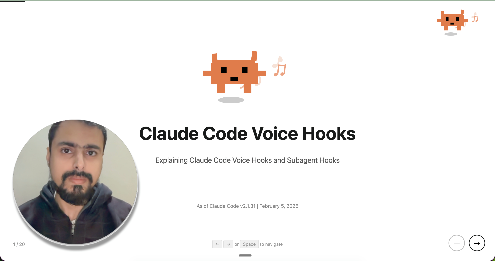

# Claude Code Voice Hooks
[](https://github.com/shanraisshan/claude-code-voice-hooks/blob/main/.claude/hooks/HOOKS-README.md#hook-events-overview---official-18-hooks) [-white?style=flat&labelColor=555)](https://github.com/anthropics/claude-code/blob/main/CHANGELOG.md)

<p align="center">
  
</p>

<p align="center">
  
</p>

<p align="center">
  
</p>

# [Demo Video + Presentation](https://youtu.be/6_y3AtkgjqA)

<p>
  <a href="https://youtu.be/6_y3AtkgjqA"></a>&nbsp;
  <a href="presentation/index.html"></a>
</p>

[](https://youtu.be/6_y3AtkgjqA)

## Installation

<p>
  <a href="install/README-mac.md"></a>&nbsp;
  <a href="install/README-linux.md"></a>&nbsp;
  <a href="install/README-windows.md"></a>
</p>

## Common Errors

If you don't follow the prerequisites, you will see the following error on claude code start

```
SessionStart:startup hook error
```

## Changelog

| Date | Hooks | Changes | Claude Code Version | Demo |
|------|:-----:|---------|:-------------------:|:----:|
| Feb 21, 2026 | 18 | Added `WorktreeCreate` and `WorktreeRemove` | [v2.1.50](https://github.com/anthropics/claude-code/blob/main/CHANGELOG.md#2150) | |
| Feb 20, 2026 | 16 | Added `ConfigChange` | [v2.1.49](https://github.com/anthropics/claude-code/blob/main/CHANGELOG.md#2149) | |
| Feb 6, 2026 | 15 | Added `TeammateIdle` and `TaskCompleted` | [v2.1.33](https://github.com/anthropics/claude-code/blob/main/CHANGELOG.md#2133) | |
| — | 13 | Added `PostToolUseFailure` | — | [Demo 3](https://youtu.be/6_y3AtkgjqA) |
| Jan 17, 2026 | 12 | Added `Setup` | [v2.1.10](https://github.com/anthropics/claude-code/blob/main/CHANGELOG.md#2110) | |
| Jan 7, 2026 | 12 | Added subagent hooks: `PreToolUse`, `PostToolUse`, `Stop` | [v2.1.0](https://github.com/anthropics/claude-code/blob/main/CHANGELOG.md#210) | |
| Nov 18, 2025 | 11 | Added `PermissionRequest` | [v2.0.45](https://github.com/anthropics/claude-code/blob/main/CHANGELOG.md#2045) | [Demo 2](https://youtu.be/JFPJtMNV8Qw) |
| Nov 17, 2025 | 10 | Added `SubagentStart` | [v2.0.43](https://github.com/anthropics/claude-code/blob/main/CHANGELOG.md#2043) | |
| Nov 10, 2025 | 9 | Added `Notification` | [v2.0.37](https://github.com/anthropics/claude-code/blob/main/CHANGELOG.md#2037) | [Demo 1](https://youtu.be/vgfdSUbz_b0) |
| Jul 28, 2025 | 8 | Added `SessionStart` | [v1.0.62](https://github.com/anthropics/claude-code/blob/main/CHANGELOG.md#1062) | |
| Jul 16, 2025 | 7 | Added `UserPromptSubmit` | [v1.0.54](https://github.com/anthropics/claude-code/blob/main/CHANGELOG.md#1054) | |
| Jul 10, 2025 | 6 | Added `PreCompact` | [v1.0.48](https://github.com/anthropics/claude-code/blob/main/CHANGELOG.md#1048) | |
| Jul 2, 2025 | 5 | Split `Stop` into `Stop` and `SubagentStop` | [v1.0.41](https://github.com/anthropics/claude-code/blob/main/CHANGELOG.md#1041) | |
| Jun 30, 2025 | 4 | Initial release: `PreToolUse`, `PostToolUse`, `Stop`, `SessionEnd` | [v1.0.38](https://github.com/anthropics/claude-code/blob/main/CHANGELOG.md#1038) | |

### Not in Official Docs

These items exist in the [Claude Code Changelog](https://github.com/anthropics/claude-code/blob/main/CHANGELOG.md) but are not listed in the [Official Hooks Reference](https://code.claude.com/docs/en/hooks):

| Item | Changelog | What the changelog says | What the official docs say |
|------|:---------:|------------------------|---------------------------|
| `Setup` hook | [v2.1.10](https://github.com/anthropics/claude-code/blob/main/CHANGELOG.md#2110) | Added new `Setup` hook event triggered via `--init`, `--init-only`, or `--maintenance` CLI flags | Not mentioned — official docs list 15 hooks, `Setup` excluded |
| Agent frontmatter hooks | [v2.1.0](https://github.com/anthropics/claude-code/blob/main/CHANGELOG.md#210) | Changelog mentions `PreToolUse`, `PostToolUse`, and `Stop` in frontmatter | Testing confirms **6 hooks** actually fire: PreToolUse, PostToolUse, PermissionRequest, PostToolUseFailure, Stop, SubagentStop. Official docs now say "all supported" — re-testing recommended. |

## Links

<p>
  <a href="https://www.youtube.com/watch?v=vgfdSUbz_b0"></a>&nbsp;
  <a href="https://www.linkedin.com/posts/shanraisshan_claudecode-aicoding-voicehooks-activity-7393305703697805312-4gl0"></a>&nbsp;
  <a href="https://www.reddit.com/r/ClaudeCode/comments/1otaf7f/i_just_made_claude_code_speak_using_hooks/"></a>&nbsp;
  <a href="https://x.com/shanraisshan/status/1987817251966513620"></a>&nbsp;
  <a href="https://medium.com/@shanraisshan/claude-code-just-got-a-voice-%25EF%25B8%258F-51008157305b"></a>
</p>
