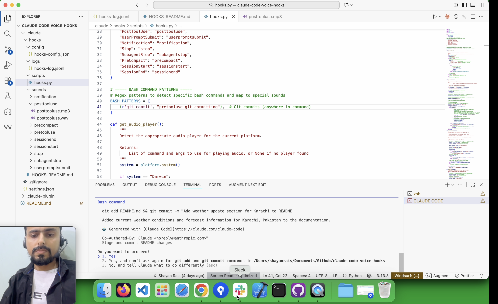

# Claude Code Voice Hooks 🔊 Ding Dong


plays #mario-start 🔊 on SessionStart and #mario-game-over 🔊 on SessionEnd

plays #ding 🔊 on PreToolUse and #dong 🔊 on PostToolUse

Providing voice feedback to your Claude Code agent! Get instant audio notifications for tool usage, prompts, git commits, and session events.

# [Demo Video](https://youtu.be/vgfdSUbz_b0)

📹 Demo video available here: 👉 [Youtube](https://youtu.be/vgfdSUbz_b0)



## Installation

### 1 ■ METHOD: Fresh Installation (No existing `.claude/settings.json`)

Use this method if you **don't have** a `.claude/settings.json` file in your project.

**For macOS/Linux:**
```bash
cd your-project
mkdir -p .claude
git clone https://github.com/shanraisshan/claude-code-voice-hooks.git temp-hooks
cp -r temp-hooks/.claude/. .claude/
rm -f .claude/settings-windows.json
rm -rf temp-hooks
```

**For Windows (PowerShell):**
```powershell
cd your-project
New-Item -ItemType Directory -Force -Path .claude
git clone https://github.com/shanraisshan/claude-code-voice-hooks.git temp-hooks
Copy-Item -Recurse -Force temp-hooks\.claude\* .claude\
Remove-Item .claude\settings.json
Rename-Item .claude\settings-windows.json settings.json
Remove-Item -Recurse -Force temp-hooks
```

**For Windows (Command Prompt):**
```cmd
cd your-project
if not exist .claude mkdir .claude
git clone https://github.com/shanraisshan/claude-code-voice-hooks.git temp-hooks
xcopy /E /I /Y temp-hooks\.claude\* .claude\
del .claude\settings.json
ren .claude\settings-windows.json settings.json
rmdir /S /Q temp-hooks
```

---

### 2 ■ METHOD: Merge with Existing `.claude/settings.json`

Use this method if you **already have** a `.claude/settings.json` file with your own hooks or settings.

#### A ■ Step: Copy only the hook scripts and resources

**For macOS/Linux:**
```bash
cd your-project
mkdir -p .claude/hooks
git clone https://github.com/shanraisshan/claude-code-voice-hooks.git temp-hooks
cp -r temp-hooks/.claude/hooks/* .claude/hooks/
rm -rf temp-hooks
```

**For Windows (PowerShell):**
```powershell
cd your-project
New-Item -ItemType Directory -Force -Path .claude\hooks
git clone https://github.com/shanraisshan/claude-code-voice-hooks.git temp-hooks
Copy-Item -Recurse -Force temp-hooks\.claude\hooks\* .claude\hooks\
Remove-Item -Recurse -Force temp-hooks
```

**For Windows (Command Prompt):**
```cmd
cd your-project
if not exist .claude\hooks mkdir .claude\hooks
git clone https://github.com/shanraisshan/claude-code-voice-hooks.git temp-hooks
xcopy /E /I /Y temp-hooks\.claude\hooks\* .claude\hooks\
rmdir /S /Q temp-hooks
```

#### B ■ Step: Manually merge hooks into your existing `.claude/settings.json`

Open your existing `.claude/settings.json` and add the 2 keys (disableAllHooks and hooks) below

**For macOS/Linux:** (use `python3`)
```
  "disableAllHooks": false,
  "hooks": {
    "PreToolUse": [{"hooks": [{"type": "command", "command": "python3 ${CLAUDE_PROJECT_DIR}/.claude/hooks/scripts/hooks.py"}]}],
    "PermissionRequest": [{"hooks": [{"type": "command", "command": "python3 ${CLAUDE_PROJECT_DIR}/.claude/hooks/scripts/hooks.py"}]}],
    "PostToolUse": [{"hooks": [{"type": "command", "command": "python3 ${CLAUDE_PROJECT_DIR}/.claude/hooks/scripts/hooks.py"}]}],
    "UserPromptSubmit": [{"hooks": [{"type": "command", "command": "python3 ${CLAUDE_PROJECT_DIR}/.claude/hooks/scripts/hooks.py"}]}],
    "Notification": [{"hooks": [{"type": "command", "command": "python3 ${CLAUDE_PROJECT_DIR}/.claude/hooks/scripts/hooks.py"}]}],
    "Stop": [{"hooks": [{"type": "command", "command": "python3 ${CLAUDE_PROJECT_DIR}/.claude/hooks/scripts/hooks.py"}]}],
    "SubagentStart": [{"hooks": [{"type": "command", "command": "python3 ${CLAUDE_PROJECT_DIR}/.claude/hooks/scripts/hooks.py"}]}],
    "SubagentStop": [{"hooks": [{"type": "command", "command": "python3 ${CLAUDE_PROJECT_DIR}/.claude/hooks/scripts/hooks.py"}]}],
    "PreCompact": [{"hooks": [{"type": "command", "command": "python3 ${CLAUDE_PROJECT_DIR}/.claude/hooks/scripts/hooks.py"}]}],
    "SessionStart": [{"hooks": [{"type": "command", "command": "python3 ${CLAUDE_PROJECT_DIR}/.claude/hooks/scripts/hooks.py"}]}],
    "SessionEnd": [{"hooks": [{"type": "command", "command": "python3 ${CLAUDE_PROJECT_DIR}/.claude/hooks/scripts/hooks.py"}]}],
    "Setup": [{"hooks": [{"type": "command", "command": "python3 ${CLAUDE_PROJECT_DIR}/.claude/hooks/scripts/hooks.py"}]}]
  }
```

**For Windows:** (use `python` and relative path)
```
  "disableAllHooks": false,
  "hooks": {
    "PreToolUse": [{"hooks": [{"type": "command", "command": "python .claude/hooks/scripts/hooks.py"}]}],
    "PermissionRequest": [{"hooks": [{"type": "command", "command": "python .claude/hooks/scripts/hooks.py"}]}],
    "PostToolUse": [{"hooks": [{"type": "command", "command": "python .claude/hooks/scripts/hooks.py"}]}],
    "UserPromptSubmit": [{"hooks": [{"type": "command", "command": "python .claude/hooks/scripts/hooks.py"}]}],
    "Notification": [{"hooks": [{"type": "command", "command": "python .claude/hooks/scripts/hooks.py"}]}],
    "Stop": [{"hooks": [{"type": "command", "command": "python .claude/hooks/scripts/hooks.py"}]}],
    "SubagentStart": [{"hooks": [{"type": "command", "command": "python .claude/hooks/scripts/hooks.py"}]}],
    "SubagentStop": [{"hooks": [{"type": "command", "command": "python .claude/hooks/scripts/hooks.py"}]}],
    "PreCompact": [{"hooks": [{"type": "command", "command": "python .claude/hooks/scripts/hooks.py"}]}],
    "SessionStart": [{"hooks": [{"type": "command", "command": "python .claude/hooks/scripts/hooks.py"}]}],
    "SessionEnd": [{"hooks": [{"type": "command", "command": "python .claude/hooks/scripts/hooks.py"}]}],
    "Setup": [{"hooks": [{"type": "command", "command": "python .claude/hooks/scripts/hooks.py"}]}]
  }
```

---

### 3 ■ Optional: Test Agent Hooks

To test the agent-specific hooks (PreToolUse, PostToolUse, Stop), copy the demo agent file:

**For macOS/Linux:**
```bash
cd your-project
mkdir -p .claude/agents
git clone https://github.com/shanraisshan/claude-code-voice-hooks.git temp-hooks
cp temp-hooks/.claude/agents/claude-code-voice-hook-agent.md .claude/agents/
rm -rf temp-hooks
```

**For Windows (PowerShell):**
```powershell
cd your-project
New-Item -ItemType Directory -Force -Path .claude\agents
git clone https://github.com/shanraisshan/claude-code-voice-hooks.git temp-hooks
Copy-Item temp-hooks\.claude\agents\claude-code-voice-hook-agent.md .claude\agents\
Remove-Item -Recurse -Force temp-hooks
```

**For Windows (Command Prompt):**
```cmd
cd your-project
if not exist .claude\agents mkdir .claude\agents
git clone https://github.com/shanraisshan/claude-code-voice-hooks.git temp-hooks
copy temp-hooks\.claude\agents\claude-code-voice-hook-agent.md .claude\agents\
rmdir /S /Q temp-hooks
```

After copying, run the agent in Claude Code with:
```
/agents claude-code-voice-hook-agent
```

This agent fetches the weather for Dubai and demonstrates the PreToolUse, PostToolUse, and Stop hooks in action.

## Update to v3

If you have an older version of the hooks installed, follow these steps to update to v3:

### Step 1: Remove existing hooks

**For macOS/Linux:**
```bash
cd your-project
rm -rf .claude/hooks
```

**For Windows (PowerShell):**
```powershell
cd your-project
Remove-Item -Recurse -Force .claude\hooks
```

**For Windows (Command Prompt):**
```cmd
cd your-project
rmdir /S /Q .claude\hooks
```

### Step 2: Install the latest hooks using Method 2

Follow the [Installation](#installation) instructions above to install the latest version. Use Method 2 to merge the latest hooks into your existing `.claude/settings.json`.

---

## Features

- 🔊 Audio feedback for all 12 Claude Code hook events
- 🎵 Special sound for git commits
- 🖥️ Cross-platform support (macOS, Linux, Windows)
- ⚙️ Easy enable/disable configuration (global and per-hook)
- 📝 Optional detailed logging for debugging (can be disabled)
- 🎨 Customizable per-hook settings

## Prerequisites

All details are mentioned in [HOOKS-README.md](/.claude/hooks/HOOKS-README.md)

Before using hooks, ensure you have **Python 3** installed on your system:

#### All Platforms (Windows, macOS, Linux)
- **Python 3**: Required for running the hook scripts
- Verify installation:
  - macOS/Linux: `python3 --version`
  - Windows: `python --version`

**Installation:**
- **Windows**: Download from [python.org](https://www.python.org/downloads/) or install via `winget install Python.Python.3`
- **macOS**: Install via `brew install python3` (requires [Homebrew](https://brew.sh/))
- **Linux**: Install via `sudo apt install python3` (Ubuntu/Debian) or `sudo yum install python3` (RHEL/CentOS)

**Audio Players (automatically detected):**
- **macOS**: `afplay` (built-in, no installation needed)
- **Linux**: `paplay` from `pulseaudio-utils` - install via `sudo apt install pulseaudio-utils`
- **Windows**: Built-in `winsound` module (included with Python)

## Common Errors

If you don't follow the prerequisites, you will see the following error on claude code start

```
SessionStart:startup hook error
```

## Changelog

- **v3** (Jan 19, 2026): Added `Setup` hook (12 hooks) — runs when Claude Code executes the /setup command for project initialization
- **v2** (Nov 26, 2025): Added `PermissionRequest` and `SubagentStart` hooks (11 hooks) — introduced in [Claude Code v2.0.43](https://github.com/anthropics/claude-code/blob/main/CHANGELOG.md#2043) and [v2.0.45](https://github.com/anthropics/claude-code/blob/main/CHANGELOG.md#2045) ■ [Demo 2](https://youtu.be/JFPJtMNV8Qw)
- **v1** (Nov 5, 2025): Initial release with 9 hooks ■ [Demo 1](https://youtu.be/vgfdSUbz_b0)

## Generated By
Claude Code

## Links

- [Youtube](https://www.youtube.com/watch?v=vgfdSUbz_b0)
- [LinkedIn](https://www.linkedin.com/posts/shanraisshan_claudecode-aicoding-voicehooks-activity-7393305703697805312-4gl0)
- Reddit [ClaudeCode](https://www.reddit.com/r/ClaudeCode/comments/1otaf7f/i_just_made_claude_code_speak_using_hooks/) [ClaudeAI](https://www.reddit.com/r/ClaudeAI/comments/1otau6p/gave_claude_code_a_voice_realtime_sound_hooks_for/) [claude](https://www.reddit.com/r/claude/comments/1otaivx/comment/no3rztv/) [aiagents](https://www.reddit.com/r/aiagents/comments/1otcezn/made_my_ai_agent_audible_claude_code_now_talks/) [claudexplorers](https://www.reddit.com/r/claudexplorers/comments/1ovu5fq/i_gave_claude_code_a_soundtrack_realtime_sounds/) [AiBuilders](https://www.reddit.com/r/AiBuilders/comments/1ouxyr3/your_ai_doesnt_have_to_be_silent_i_made_claude/) [ChatGPTCoding](https://www.reddit.com/r/ChatGPTCoding/comments/1ou2vea/turned_claude_code_into_a_soundboard_every_action/) [vibecoding](https://www.reddit.com/r/vibecoding/comments/1otefyd/comment/noslj0e/)
- [X](https://x.com/shanraisshan/status/1987817251966513620)
- [Medium](https://medium.com/@shanraisshan/claude-code-just-got-a-voice-%25EF%25B8%258F-51008157305b)
